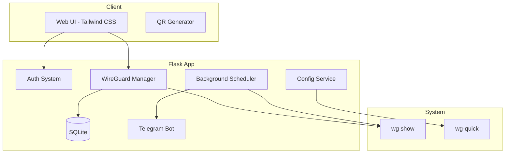

# WireGuard GUI - Agent Context

This document provides context for AI agents working on the WireGuard GUI project.

## Project Overview

WireGuard GUI is a Flask web application for managing WireGuard VPN users with:
- SQLite database persistence
- Multi-user authentication system (all admins)
- Key and configuration generation with QR codes (no disk persistence for private keys)
- Telegram integration for notifications
- Modern dashboard with Tailwind CSS

## Component Contexts

The project is organized into 4 main components:

1. **[GUI Component](context/gui.md)** - Web interface, templates, and user interactions
2. **[System Interaction Component](context/system_interaction.md)** - WireGuard management, tunnel control, and system commands
3. **[Data Structure Component](context/data_structure.md)** - Database models, settings, and data flow
4. **[Notifications Component](context/notifications.md)** - Dashboard flash messages and Telegram bot notifications
5. **[Telegram Bot Component](context/telegram_bot.md)** - Notifications, templates, and messaging

## Quick Reference

### Key Files
- [`app.py`](app.py) - Main Flask application with all routes
- [`wggui/database.py`](wggui/database.py) - Database models and settings
- [`wggui/wireguard.py`](wggui/wireguard.py) - WireGuard operations and key generation
- [`wggui/tunnel.py`](wggui/tunnel.py) - Tunnel management functions
- [`wggui/telegram.py`](wggui/telegram.py) - Telegram bot integration
- [`wggui/scheduler.py`](wggui/scheduler.py) - Background scheduler for peer status
- [`wggui/config_service.py`](wggui/config_service.py) - Centralized config management

### Architecture Overview

### Database Schema
- **users** - Panel users with SHA256 + salt password hashing
- **peers** - WireGuard peers with keys, IPs, and status
- **connection_history** - Log of connection events
- **settings** - Application configuration stored as key-value pairs

### Key Settings
- `wg_interface` - WireGuard interface name (default: wg0)
- `wg_tunnel_name` - Tunnel name for wg-quick
- `wg_network` - VPN network in CIDR format
- `server_private_key` - Server private key (write-only, never displayed)
- `telegram_*` - Telegram notification settings
- `auto_restart_tunnel` - Auto-restart tunnel on config changes

### Important Notes

1. **Private keys never touch disk** - Generated in memory using `wg genkey`
2. **Server private key is write-only** - Stored in DB but never shown in UI
3. **All users are admins** - No role-based access control
4. **Config regeneration** - Config is regenerated on peer changes
5. **Tunnel restart** - Optional auto-restart based on settings
