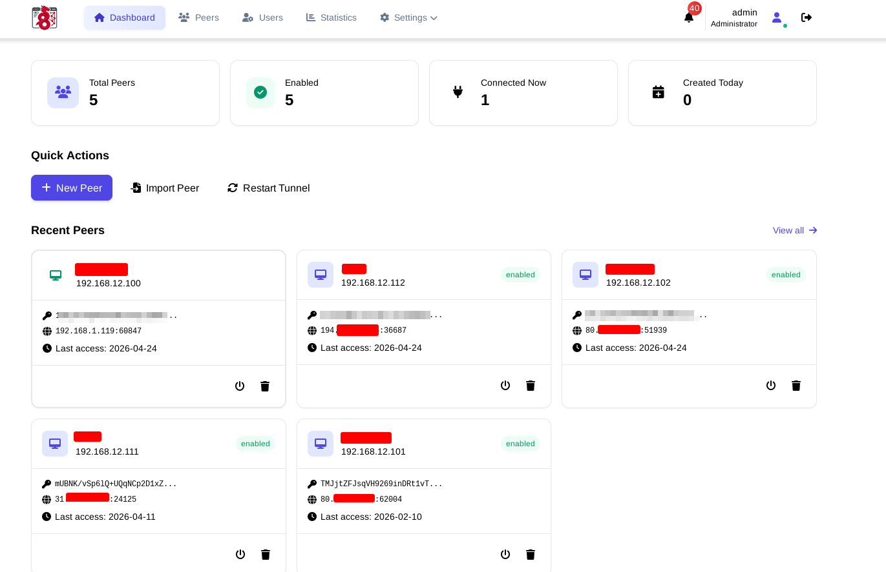
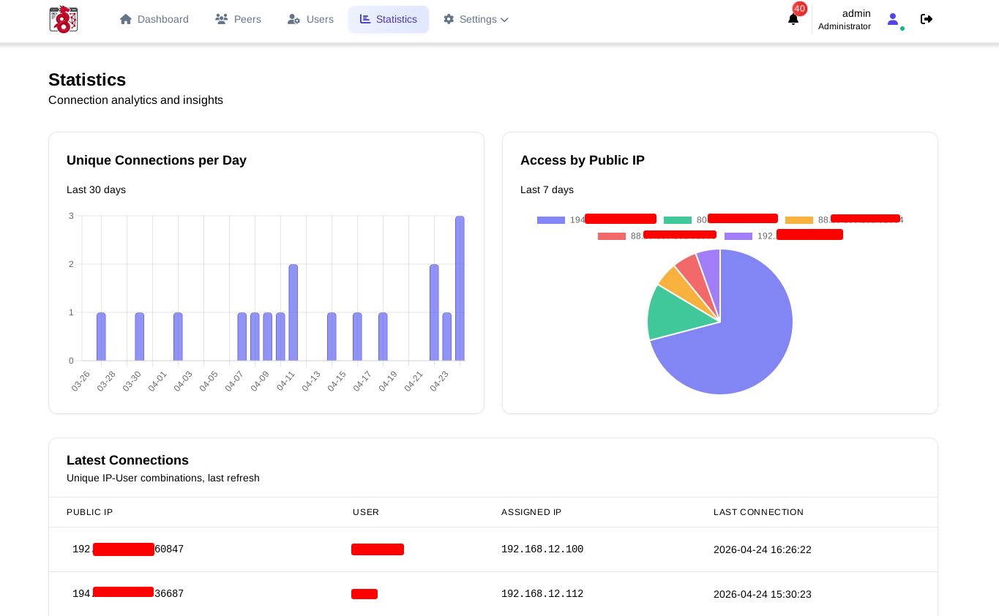

# WireGuard GUI


A secure, modern web interface for WireGuard VPN servers.

[](https://opensource.org/licenses/MIT)
[](https://www.python.org/)

## Screenshots

| Dashboard | Statistics |
|-----------|------------|
|  |  |

## Features

| Peer Management | Security | Statistics |
|-----------------|----------|------------|
| Create peers with auto-generated keys | Input validation on all fields | Connection history with timestamps |
| Enable/disable without deleting | Keys never written to disk | Daily unique connections histogram |
| QR code generation for mobile apps | SQL injection prevention via ORM | Public IP access pie chart |
| Import existing peer configurations | Path traversal protection | Full events log with date filtering |

| Notifications | Configuration | Data Management |
|--------------|---------------|-----------------|
| Telegram bot integration | Interface and tunnel setup | Export/import configuration as JSON |
| Customizable message templates | Port, network, DNS settings | Automatic config file backup |
| Real-time connection alerts | CIDR validation for all IPs | Atomic writes with rollback |

## Quick Start

```bash
git clone <repository-url>
cd wireguard_gui
python -m venv venv
source venv/bin/activate
pip install -r requirements.txt
python app.py
```

Access at `http://localhost:5000` and create your admin account on first login.

## Project Structure

```
wireguard_gui/
├── app.py                      # Flask application and routes
├── config.py                   # Flask configuration
├── requirements.txt            # Python dependencies
├── wggui/
│   ├── __init__.py
│   ├── auth.py                 # Flask-Login authentication
│   ├── database.py             # SQLAlchemy models and validators
│   ├── tunnel.py               # Tunnel management and prerequisites
│   ├── wireguard.py            # Key generation and config building
│   ├── telegram.py             # Telegram notifications
│   ├── scheduler.py            # Background polling scheduler
│   ├── config_service.py       # Config file generation
│   └── templates/              # Jinja2 HTML templates
├── static/
│   ├── css/                    # Stylesheets
│   └── logo.png                # Application logo
└── pictures/
    ├── dashboard.png           # Dashboard screenshot
    └── statistics.png          # Statistics page screenshot
```

## Security Notes

- **Private Key Handling**: Server keys stored in DB; client keys exist only in memory during creation
- **Input Validation**: Strict validation on ports (1024-65535), IPs (CIDR notation), hostnames, peer names
- **Path Traversal Protection**: Config paths must resolve to `/etc/wireguard/` after normalization
- **Template Injection Protection**: Telegram templates use variable allowlist with escaping
- **No Sensitive Data Exposure**: Stack traces never shown to users; logged internally

## License

MIT