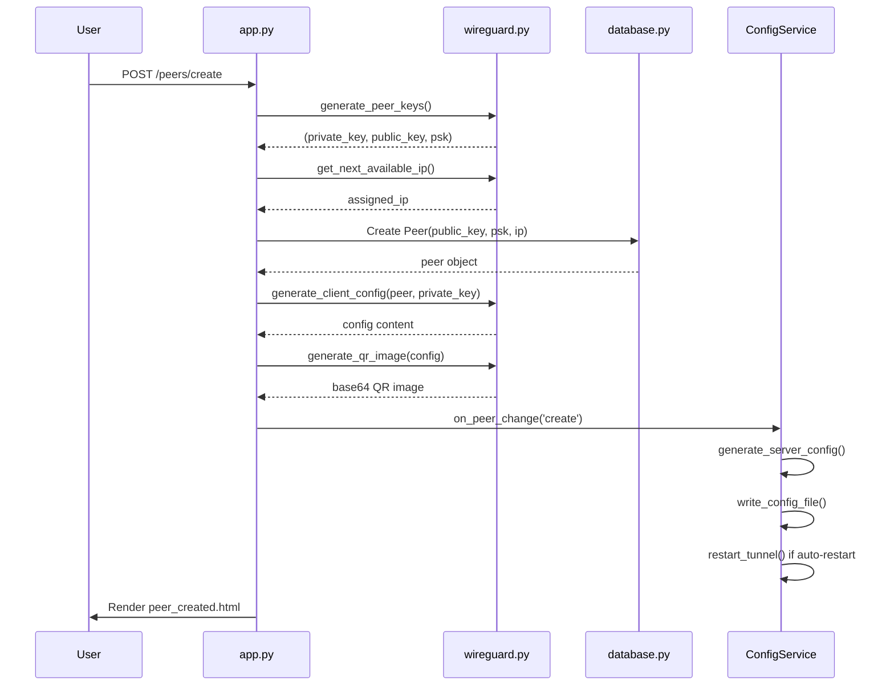
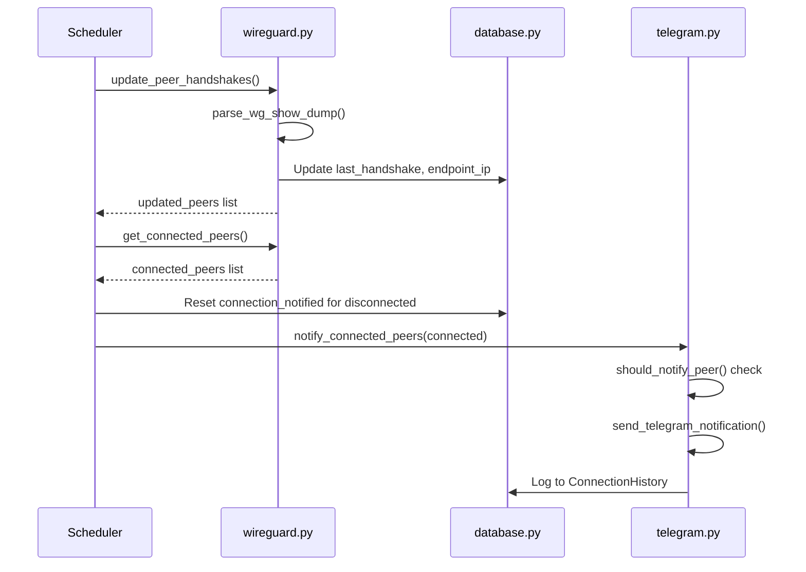
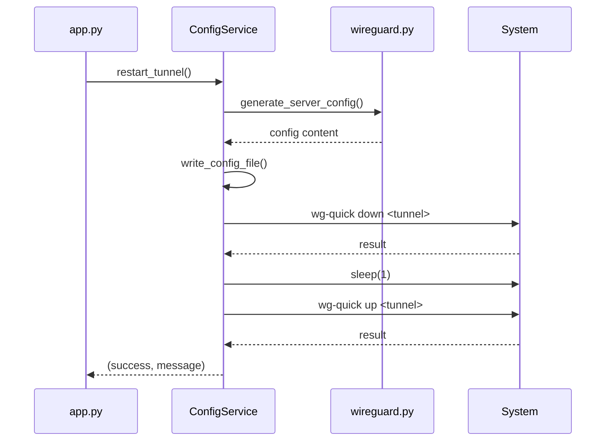

# Data Structure Component Context

## Overview

The Data Structure component defines all database models, settings storage, and data flow within the application using SQLAlchemy with SQLite.

## Key Files

- [`wggui/database.py`](wggui/database.py) - Database models and settings management

## Database Models

### User Model

Located in [`database.py`](wggui/database.py:20-36):

```python
class User(db.Model, UserMixin):
    id              # INTEGER PRIMARY KEY
    username        # STRING UNIQUE, nullable=False
    password_hash   # STRING (SHA256 hex), nullable=False
    salt            # STRING (64 hex chars), nullable=False
    created_at      # DATETIME, default=utcnow
    last_login      # DATETIME, nullable=True
```

**Password Handling:**
- Salt generated via `secrets.token_hex(32)`
- Hash computed as `SHA256(password + salt)`
- Methods: `set_password(password)`, `check_password(password)`

### Peer Model

Located in [`database.py`](wggui/database.py:39-63):

```python
class Peer(db.Model):
    id              # INTEGER PRIMARY KEY
    name            # STRING, nullable=False
    public_key      # STRING (44 chars, base64), UNIQUE, nullable=False
    pre_shared_key  # STRING (44 chars, base64), nullable=True
    assigned_ip     # STRING (IPv4), UNIQUE, nullable=False
    allowed_ips     # STRING (comma-separated CIDRs), nullable=True
    status          # STRING, default='enabled'
    created_at      # DATETIME, default=utcnow
    last_handshake  # DATETIME, nullable=True
    connection_notified  # BOOLEAN, default=False
    endpoint_ip     # STRING (IP:port), nullable=True
```

**Methods:**
- `to_dict()` - Serialize to dictionary for JSON export

### ConnectionHistory Model

Located in [`database.py`](wggui/database.py:66-75):

```python
class ConnectionHistory(db.Model):
    id              # INTEGER PRIMARY KEY
    peer_id         # INTEGER FOREIGN KEY, nullable=False
    event_type      # STRING ('connection', 'disconnection', 'creation'), nullable=False
    timestamp       # DATETIME, default=utcnow
    details         # TEXT, nullable=True
    endpoint_ip     # STRING (IP:port), nullable=True
    
    peer = relationship('Peer', backref='connection_history')
```

### Settings Model

Located in [`database.py`](wggui/database.py:78-81):

```python
class Settings(db.Model):
    key             # STRING PRIMARY KEY
    value           # TEXT, nullable=True
```

All settings stored as key-value pairs, converted to string.

## Settings Management

Located in [`database.py`](wggui/database.py:84-98):

```python
get_setting(key, default=None)  # Get setting value
set_setting(key, value)         # Set setting value (converts to string)
```

### Default Settings

Located in [`database.py`](wggui/database.py:101-127):

| Setting | Default | Description |
|---------|---------|-------------|
| `wg_interface` | `wg0` | WireGuard interface name |
| `wg_tunnel_name` | `wg0` | Tunnel name for wg-quick |
| `wg_listen_port` | `51820` | Listen port |
| `wg_network` | `10.0.0.0/24` | VPN network CIDR |
| `wg_allowed_ips` | `` | Default AllowedIPs for clients (comma-separated CIDRs) |
| `wg_dns` | `1.1.1.1` | DNS servers |
| `wg_endpoint_host` | `` | Endpoint hostname |
| `wg_endpoint_port` | `51820` | Endpoint port |
| `refresh_interval` | `30` | Scheduler interval (seconds) |
| `auto_restart_tunnel` | `True` | Auto-restart on config change |
| `server_config_path` | `/etc/wireguard/wg0.conf` | Config file path |
| `server_private_key` | `` | Server private key (write-only) |
| `server_public_key` | `` | Server public key |
| `telegram_enabled` | `False` | Enable notifications |
| `telegram_bot_token` | `` | Bot token |
| `telegram_chat_id` | `` | Chat ID |
| `telegram_expire_seconds` | `300` | Re-notify after X seconds |
| `telegram_message_template` | (template) | Notification template |

## Data Flow

### Peer Creation Flow



### Scheduler Refresh Flow



### Tunnel Restart Flow



## Database Initialization

Located in [`app.py`](app.py:26-29):

```python
with app.app_context():
    db.create_all()
    init_default_settings()
    scheduler = start_scheduler(app)
```

Creates all tables and initializes default settings on startup.

## Export/Import

### Export Format

Located in [`app.py`](app.py:561-597):

```json
{
  "version": "1.0",
  "exported_at": "2024-01-15T10:30:00Z",
  "settings": { "key": "value", ... },
  "peers": [
    {
      "id": 1,
      "name": "peer-01",
      "public_key": "xxx...",
      "pre_shared_key": "yyy...",
      "assigned_ip": "10.0.0.2",
      "allowed_ips": "10.0.0.0/24, 192.168.1.0/24",
      "status": "enabled",
      "created_at": "2024-01-15T10:30:00Z",
      "last_handshake": null
    }
  ],
  "history": [
    {
      "peer_id": 1,
      "event_type": "connection",
      "timestamp": "2024-01-15T10:35:00Z",
      "details": "Notification sent via Telegram",
      "endpoint_ip": "1.2.3.4:12345"
    }
  ]
}
```

### Import Process

Located in [`app.py`](app.py:600-654):

1. Parse JSON file
2. Import settings (upsert)
3. Import peers (skip if exists by public_key or IP)
4. Commit transaction
5. Regenerate server config and restart tunnel

## Connection Status Logic

A peer is considered "connected" if:
```python
peer.last_handshake exists AND
(datetime.utcnow() - peer.last_handshake).total_seconds() < 120
```

## Field Constraints

| Field | Constraint |
|-------|------------|
| `User.username` | Unique |
| `Peer.public_key` | Unique |
| `Peer.assigned_ip` | Unique |
| `Settings.key` | Unique (primary key) |

## DateTime Storage

All datetime fields stored in UTC. Conversion happens at application level.

## String Conversions

Settings values are converted to strings when stored:
```python
set_setting('auto_restart_tunnel', 'True')  # Boolean becomes string
```

When reading, caller is responsible for type conversion.
