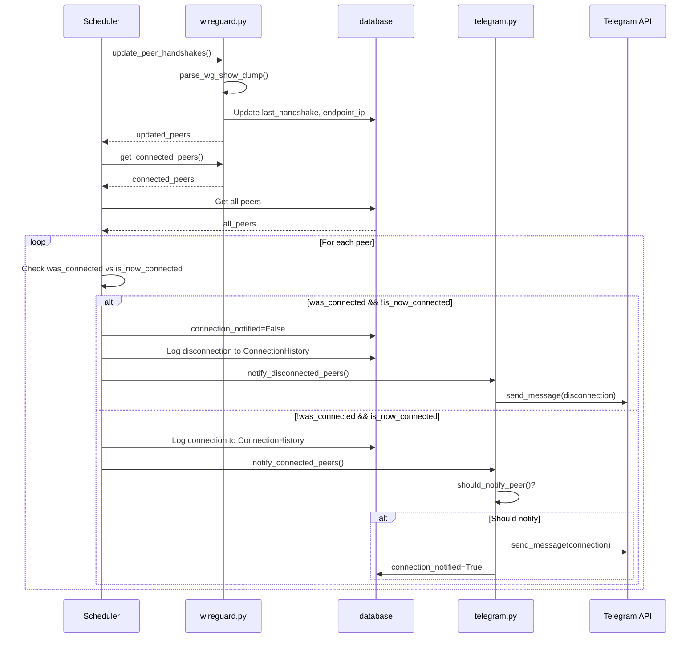

# Sistema de Notificaciones

## Overview

El sistema de notificaciones de WireGuard GUI tiene dos componentes principales:
1. **Notificaciones del Dashboard** - Mensajes flash mostrados en la interfaz web
2. **Notificaciones de Telegram** - Mensajes enviados al bot de Telegram

---

## Notificaciones del Dashboard

### Flash Messages

Las notificaciones del dashboard utilizan el sistema de `flash` de Flask para mostrar mensajes temporales al usuario.

**Ubicación**: [`app.py`](app.py:194-207) - Plantilla base

**Categorías**:
| Categoría | Estilo | Icono |
|-----------|--------|-------|
| `success` | Verde | `fa-check-circle` |
| `error` | Rojo | `fa-exclamation-circle` |
| `warning` | Amarillo | Similar a error |

**Comportamiento**:
- Se muestran en la esquina superior derecha (línea 195)
- Se ocultan automáticamente después de 5 segundos (línea 236-245)
- Soportan autoclose con animación de desvanecimiento

### Tipos de Notificaciones del Dashboard

| Operación | Mensaje | Categoría |
|-----------|---------|-----------|
| Login exitoso | "Usuario administrador creado. Inicia sesión." | success |
| Login fallido | "Credenciales inválidas" | error |
| Crear peer | "Peer creado y túnel reiniciado automáticamente" | success |
| Crear peer (error parcial) | "Peer creado pero error al actualizar config: {msg}" | warning |
| Importar peer | "Peer importado correctamente. Configuración actualizada." | success |
| Habilitar peer | "Peer {name} habilitado y túnel reiniciado automáticamente" | success |
| Deshabilitar peer | "Peer {name} deshabilitado y túnel reiniciado automáticamente" | success |
| Eliminar peer | "Peer {name} eliminado y túnel reiniciado automáticamente" | success |
| Guardar settings | "Configuración guardada" | success |
| Reiniciar túnel | "{msg} Túnel reiniciado correctamente." | success |
| Iniciar túnel | "Túnel {tunnel_name} iniciado correctamente" | success |
| Detener túnel | "Túnel {tunnel_name} detenido correctamente" | success |
| Test Telegram | "{msg}" (éxito o error) | success/error |
| Exportar config | Genera descarga | - |
| Importar config | "Configuración importada y túnel reiniciado automáticamente" | success |

### API de Notificaciones del Dashboard

**Endpoint**: [`/api/notifications`](app.py:680-710)

```python
@app.route('/api/notifications')
@login_required
def api_notifications():
    """API endpoint for recent notifications."""
    recent = ConnectionHistory.query.order_by(
        ConnectionHistory.timestamp.desc()
    ).limit(10).all()
    
    notifications = []
    for h in recent:
        peer = Peer.query.get(h.peer_id)
        notifications.append({
            'id': h.id,
            'type': h.event_type,        # 'connection', 'disconnection', 'creation'
            'peer_name': peer.name if peer else 'Unknown',
            'timestamp': h.timestamp.isoformat(),
            'details': h.details,
            'time_ago': get_time_ago(h.timestamp)
        })
    
    # Count unread (last 24 hours)
    unread_count = ConnectionHistory.query.filter(
        ConnectionHistory.timestamp > datetime.utcnow() - timedelta(hours=24)
    ).count()
    
    return jsonify({
        'notifications': notifications,
        'unread_count': unread_count
    })
```

**Formato de respuesta**:
```json
{
    "notifications": [
        {
            "id": 123,
            "type": "connection",
            "peer_name": "peer-01",
            "timestamp": "2024-01-15T10:30:00",
            "details": "Sesión establecida",
            "time_ago": "Hace 5 minutos"
        }
    ],
    "unread_count": 5
}
```

### Visualización en el Dashboard

Las notificaciones se muestran en un dropdown en la navbar (líneas 123-140 de [`base.html`](wggui/templates/base.html:123-140)):

- **Icono de campana** con badge de contador rojo
- **Dropdown** con lista de notificaciones recientes
- **Iconos por tipo**:
  - `connection`: `fa-plug text-success-500`
  - `disconnection`: `fa-plug-circle-xmark text-danger-500`
  - `creation`: `fa-circle-info text-primary-500`

---

## Notificaciones de Telegram

### Configuración

| Setting | Default | Descripción |
|---------|---------|-------------|
| `telegram_enabled` | `False` | Habilitar/deshabilitar notificaciones |
| `telegram_bot_token` | `` | Token del Bot API |
| `telegram_chat_id` | `` | ID del chat destino |
| `telegram_expire_seconds` | `300` | Segundos antes de re-notificar |
| `telegram_message_template` | (template) | Formato del mensaje |

**Ubicación de configuración**: [`database.py`](wggui/database.py:104-127)

### Plantilla por Defecto

```markdown
🔔 *Nuevo Acceso WireGuard*

👤 *Cliente:* {name}
🌐 *IP:* `{ip}`
📅 *Hora:* {timestamp}

✅ Sesión establecida
```

### Variables de Plantilla

| Variable | Descripción | Ejemplo |
|----------|-------------|---------|
| `{name}` | Nombre del peer | peer-01 |
| `{ip}` | IP asignada (interna) | 10.0.0.2 |
| `{endpoint_ip}` | IP pública del peer | 1.2.3.4:54321 |
| `{timestamp}` | Fecha y hora UTC | 2024-01-15 10:30:00 UTC |
| `{public_key}` | Clave pública truncada | AbCdEf... |
| `{status}` | Estado de conexión | Conectado/Desconectado |
| `{duration}` | Duración de sesión | - |

### Funciones Principales

#### send_telegram_notification()

```python
def send_telegram_notification(peer, event_type='connection') -> (success: bool, message: str)
```

Envía notificación al chat configurado usando la plantilla.

**Flujo**:
1. Verifica si notificaciones están habilitadas
2. Valida credentials (token y chat_id)
3. Construye mensaje reemplazando variables
4. Envía via Bot API con `parse_mode='Markdown'`

**Retorno**:
- `(True, "Notification sent successfully")` - Éxito
- `(False, "Telegram notifications are disabled")` - Deshabilitado
- `(False, "Telegram credentials not configured")` - Sin credenciales
- `(False, "Telegram error: ...")` - Error de API

#### should_notify_peer()

```python
def should_notify_peer(peer) -> bool
```

Determina si un peer debe recibir notificación (rate limiting):

```python
def should_notify_peer(peer):
    expire_seconds = int(get_setting('telegram_expire_seconds', '300'))
    
    # Si nunca fue notificado, notificar
    if not peer.connection_notified:
        return True
    
    # Si el último handshake fue hace más de expire_seconds, notificar
    if peer.last_handshake:
        elapsed = (datetime.utcnow() - peer.last_handshake).total_seconds()
        if elapsed > expire_seconds:
            return True
    
    return False
```

#### notify_connected_peers()

```python
def notify_connected_peers(peers) -> list[dict]
```

Notifica sobre peers recién conectados:

1. Itera sobre cada peer
2. Verifica `should_notify_peer()`
3. Envia notificación
4. Si éxito: marca `connection_notified = True`
5. Guarda en `ConnectionHistory`
6. Retorna lista de resultados

#### notify_disconnected_peers()

```python
def notify_disconnected_peers(peers) -> list[dict]
```

Notifica sobre peers desconectados (no usa rate limiting):

1. Itera sobre cada peer desconectado
2. Envia notificación con `event_type='disconnection'`
3. Guarda en `ConnectionHistory`
4. Retorna lista de resultados

#### test_telegram_connection()

```python
def test_telegram_connection() -> (success: bool, message: str)
```

Envía mensaje de prueba para verificar credentials.

---

## Flujo de Notificaciones del Scheduler



---

## Modelo de Datos

### Peer

```python
class Peer(db.Model):
    id = db.Column(db.Integer, primary_key=True)
    name = db.Column(db.String(100), nullable=False)
    public_key = db.Column(db.String(44), unique=True, nullable=False)
    assigned_ip = db.Column(db.String(15), unique=True, nullable=False)
    status = db.Column(db.String(20), default='enabled')
    created_at = db.Column(db.DateTime, default=datetime.utcnow)
    last_handshake = db.Column(db.DateTime, nullable=True)
    last_connection = db.Column(db.DateTime, nullable=True)
    connection_notified = db.Column(db.Boolean, default=False)  # ← Control de notificaciones
    endpoint_ip = db.Column(db.String(50), nullable=True)
```

### ConnectionHistory

```python
class ConnectionHistory(db.Model):
    id = db.Column(db.Integer, primary_key=True)
    peer_id = db.Column(db.Integer, db.ForeignKey('peer.id'), nullable=False)
    event_type = db.Column(db.String(20), nullable=False)  # 'connection', 'disconnection', 'creation'
    timestamp = db.Column(db.DateTime, default=datetime.utcnow)
    details = db.Column(db.Text, nullable=True)
    endpoint_ip = db.Column(db.String(50), nullable=True)
    
    peer = db.relationship('Peer', backref='connection_history')
```

---

## Rate Limiting

El sistema usa `telegram_expire_seconds` (default: 300s = 5 minutos) para evitar spam:

```python
# peer.connection_notified se resetea cuando el peer se desconecta
# Cuando se reconecta:
# - Si nunca fue notificado → notificar
# - Si el handshake expiró → notificar
# - Si está dentro del período → no notificar
```

---

## Integración con el Frontend

### JavaScript en base.html

```javascript
function loadNotifications() {
    fetch('/api/notifications')
        .then(response => response.json())
        .then(data => {
            // Actualizar badge
            if (data.unread_count > 0) {
                badge.textContent = data.unread_count;
                badge.classList.remove('hidden');
            }
            
            // Renderizar lista
            list.innerHTML = data.notifications.map(n => `
                <div class="px-4 py-3 border-b border-slate-100 hover:bg-slate-50">
                    <div class="flex items-start">
                        <i class="fas ${n.type === 'connection' 
                            ? 'fa-plug text-success-500' 
                            : n.type === 'disconnection' 
                                ? 'fa-plug-circle-xmark text-danger-500' 
                                : 'fa-circle-info text-primary-500'} mt-1 mr-3"></i>
                        <div class="flex-1">
                            <p class="text-sm font-medium text-slate-900">${n.peer_name}</p>
                            <p class="text-xs text-slate-500">${n.details || n.type}</p>
                            <p class="text-xs text-slate-400 mt-1">${n.time_ago}</p>
                        </div>
                    </div>
                </div>
            `).join('');
        });
}
```

---

## Prerrequisitos

Para que las notificaciones de Telegram funcionen:
1. `telegram_enabled` = `'True'`
2. `telegram_bot_token` configurado válido
3. `telegram_chat_id` configurado válido
4. El bot debe tener permisos para enviar mensajes al chat

---

## Archivos Clave

| Archivo | Propósito |
|---------|-----------|
| [`wggui/telegram.py`](wggui/telegram.py) | Funciones de notificación Telegram |
| [`wggui/scheduler.py`](wggui/scheduler.py) | Scheduler que ejecuta refresh y notifica |
| [`wggui/database.py`](wggui/database.py) | Modelos Peer, ConnectionHistory, Settings |
| [`app.py`](app.py) | Rutas API y flash messages |
| [`wggui/templates/base.html`](wggui/templates/base.html) | UI de notificaciones dashboard |
