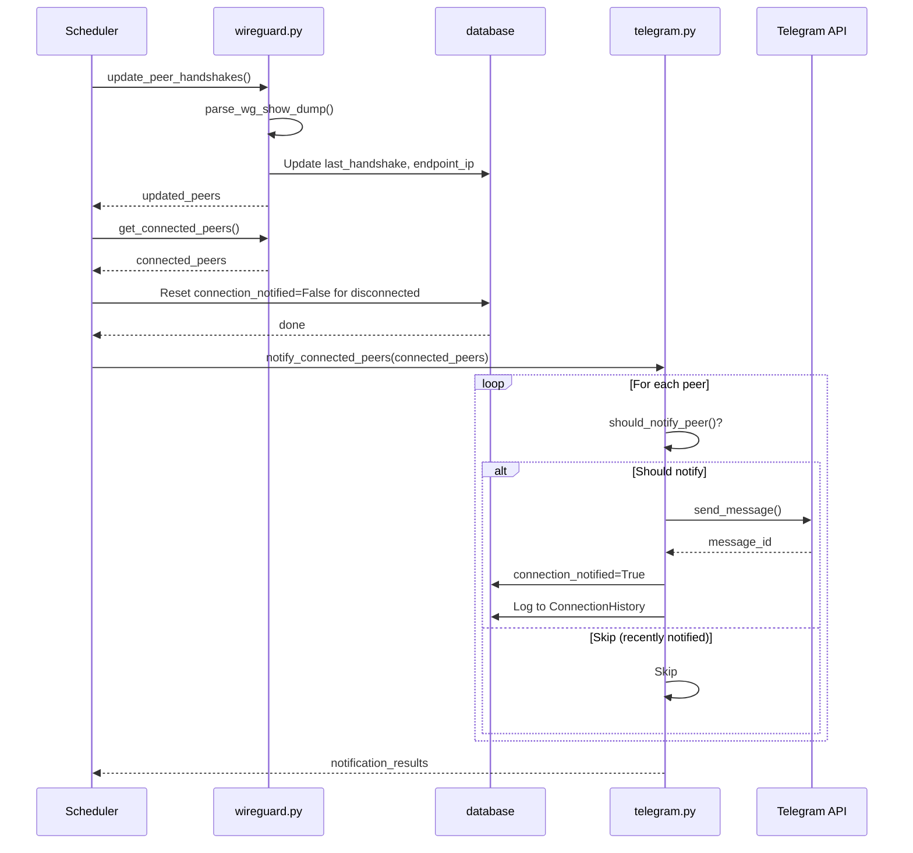

# Telegram Bot Component Context

## Overview

The Telegram Bot component handles sending notifications about peer connections and disconnections via the Telegram API.

## Key Files

- [`wggui/telegram.py`](wggui/telegram.py) - Telegram bot integration
- [`wggui/scheduler.py`](wggui/scheduler.py) - Scheduler that triggers notifications

## Configuration Settings

Located in [`database.py`](wggui/database.py:112-122):

| Setting | Default | Description |
|---------|---------|-------------|
| `telegram_enabled` | `False` | Enable/disable notifications |
| `telegram_bot_token` | `` | Bot API token |
| `telegram_chat_id` | `` | Target chat ID |
| `telegram_expire_seconds` | `300` | Seconds before re-notifying |
| `telegram_message_template` | (template) | Message format |

### Default Template

```markdown
🔔 *Nuevo Acceso WireGuard*

👤 *Cliente:* {name}
🌐 *IP:* `{ip}`
📅 *Hora:* {timestamp}

✅ Sesión establecida
```

## Telegram Functions

Located in [`telegram.py`](wggui/telegram.py):

### send_telegram_notification()

```python
send_telegram_notification(peer, event_type='connection') -> (success: bool, message: str)
```

Sends notification to configured chat ID using template variables:
- `{name}` - Peer name
- `{ip}` - Assigned IP
- `{endpoint_ip}` - Public IP:port of peer
- `{timestamp}` - Formatted timestamp
- `{public_key}` - Truncated public key
- `{status}` - 'Conectado' or 'Desconectado'
- `{duration}` - Session duration (currently '-')

Uses `parse_mode='Markdown'` for formatting.

### should_notify_peer()

```python
should_notify_peer(peer) -> bool
```

Determines if a peer should trigger notification:
1. If never notified (`connection_notified = False`) → notify
2. If last handshake was > `telegram_expire_seconds` ago → notify
3. Otherwise → don't notify (prevent spam)

### notify_connected_peers()

```python
notify_connected_peers(peers) -> list[dict]
```

For each connected peer:
1. Check `should_notify_peer()`
2. Send notification
3. On success: mark `connection_notified = True`
4. Log to `ConnectionHistory` table
5. Return list of notification results

### test_telegram_connection()

```python
test_telegram_connection() -> (success: bool, message: str)
```

Sends test message to verify credentials:
```
✅ *Prueba de conexión exitosa*

WireGuard GUI está correctamente configurado para enviar notificaciones.
```

### format_telegram_variables_help()

```python
format_telegram_variables_help() -> str
```

Returns help text listing available template variables.

## Scheduler Integration

Located in [`scheduler.py`](wggui/scheduler.py):

### refresh_peer_statuses()

```python
refresh_peer_statuses(app)
```

Background task that runs on interval:

1. **Update handshakes** - Call `update_peer_handshakes()` from wireguard.py
2. **Get connected peers** - Call `get_connected_peers()` from wireguard.py
3. **Reset notifications** - Set `connection_notified = False` for disconnected peers
4. **Send notifications** - Call `notify_connected_peers(connected)`

### start_scheduler()

```python
start_scheduler(app) -> scheduler
```

Creates BackgroundScheduler with:
- Interval: `refresh_interval` setting (default: 30 seconds)
- Job ID: `refresh_peer_statuses`

### trigger_manual_refresh()

```python
trigger_manual_refresh(app) -> (success: bool, message: str)
```

Manually triggers refresh without waiting for interval.

## Notification Flow



## Template Variables

| Variable | Description | Example |
|----------|-------------|---------|
| `{name}` | Peer name | peer-01 |
| `{ip}` | Assigned WireGuard IP | 10.0.0.2 |
| `{endpoint_ip}` | Public IP:port | 1.2.3.4:54321 |
| `{timestamp}` | UTC timestamp | 2024-01-15 10:30:00 UTC |
| `{public_key}` | Truncated public key | AbCdEf... |
| `{status}` | Connection status | Conectado |
| `{duration}` | Session duration | - |

## Error Handling

### send_telegram_notification()

- Returns `(False, "Telegram notifications are disabled")` if disabled
- Returns `(False, "Telegram credentials not configured")` if missing token/chat_id
- Returns `(False, "Telegram error: ...")` on API error

### test_telegram_connection()

- Catches `TelegramError` and returns error message
- Validates both token and chat_id before attempting

## Rate Limiting

The `telegram_expire_seconds` setting (default: 300 = 5 minutes) prevents spam:

```python
def should_notify_peer(peer):
    if not peer.connection_notified:
        return True
    if peer.last_handshake:
        elapsed = (now - peer.last_handshake).total_seconds()
        if elapsed > expire_seconds:
            return True
    return False
```

## Logging to History

When notification sent successfully, creates `ConnectionHistory` record:

```python
ConnectionHistory(
    peer_id=peer.id,
    event_type='connection',
    details='Notification sent via Telegram',
    endpoint_ip=peer.endpoint_ip
)
```

## API Endpoint for Help

Located in [`app.py`](wggui/templates/settings/telegram.html:674-678):

```python
@app.route('/api/telegram-vars')
@login_required
def api_telegram_vars():
    return jsonify({'help': format_telegram_variables_help()})
```

Returns JSON with available template variables for the settings UI.

## Markdown Formatting

Messages use Telegram's Markdown parse_mode:
- `*bold*`
- `_italic_`
- `` `code` ``
- `[text](url)`

## Prerequisites

For notifications to work:
1. `telegram_enabled` must be `'True'`
2. `telegram_bot_token` must be set
3. `telegram_chat_id` must be set
4. Bot must have permission to send messages to chat

## Testing

Test notification sent via `/settings/test-telegram` route (POST).
